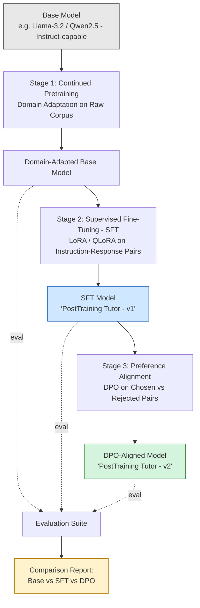

# LLM Post-Training Lab
### Building "PostTraining Tutor" : a Domain-Specific AI Tutor via Continued Pretraining, SFT, LoRA/QLoRA, and DPO

> A hands-on, end-to-end demonstration of the modern LLM post-training pipeline, taking a general-purpose base model and turning it into a small domain expert that explains LLM concepts (Transformers, LoRA, QLoRA, SFT, DPO, RLHF, Alignment) to learners.

---

## 1. Motivation

Most public tutorials stop at "here's how to fine-tune a model with LoRA." They rarely walk through the **full pipeline** a real post-training team uses: adapting a base model to a domain, teaching it to follow instructions, and then aligning its behavior with human preferences.

This repository was built to:

- Demonstrate the **complete post-training stack** : Continued Pretraining → SFT → Preference Alignment (DPO) — in one coherent project, rather than three disconnected tutorials.
- Produce a genuinely useful artifact: **PostTraining Tutor**, a lightweight model specialized in explaining LLM/post-training concepts (the same concepts used to build it i.e a deliberately self-referential demo).
- Serve as a **teaching resource** for an AI talk/presentation, with every notebook cell explaining the *what*, *why*, and *how* behind each step, not just the code.
- Give a transparent **Base vs. SFT vs. DPO comparison** using both
  generation-quality evaluation (LLM-as-a-Judge and pairwise preference)
  and a separate DPO-specific preference evaluation.


---

## 2. Architecture / Pipeline Diagram



---

## 3. Repository Structure

```
LLM-PostTraining-Lab/
│
├── data/
│   ├── llm_post_training_corpus.txt
│   ├── instruction_dataset.jsonl
│   ├── preference_dataset.jsonl
│   ├── evaluation_questions.json
│   └── held_out_preference_pairs.jsonl
│
├── notebooks/
│   ├── 01_SFT_LoRA_Unsloth.ipynb
│   ├── 02_DPO_Alignment.ipynb
│   ├── 03_Evaluation.ipynb
│   └── 04_Gradio_Demo.ipynb
│
├── src/
│   ├── dataset_utils.py
│   ├── train_sft.py
│   ├── train_dpo.py
│   └── evaluate.py
│
├── reports/
│   ├── fine_tuning_explanation.md
│   ├── lora_explanation.md
│   ├── dpo_explanation.md
│   └── results_analysis.md
│
├── presentation/
│   ├── architecture_diagram.md
│   └── slide_outline.md
│
├── outputs/
│   ├── evaluation_results.csv
│   └── plots/
│
├── README.md
├── requirements.txt
└── .gitignore
```


---

## 4. Technology Stack

| Tool | Role in this project |
|---|---|
| **Google Colab** | Free GPU environment (T4/A100) to run all three training stages |
| **Unsloth** | 2–5x faster LoRA/QLoRA fine-tuning with lower VRAM use; used for Stage 1 & 2 |
| **Hugging Face Transformers** | Base model + tokenizer loading, generation/inference |
| **Hugging Face Datasets** | Loading and formatting `.jsonl` / `.txt` data into training-ready datasets |
| **PEFT** | Parameter-Efficient Fine-Tuning — implements LoRA adapter injection |
| **LoRA** | Low-Rank Adaptation — trains small adapter matrices instead of full weights |
| **QLoRA** | LoRA on top of a 4-bit quantized base model — cuts memory further |
| **TRL** | Hugging Face's Transformer Reinforcement Learning library — provides `SFTTrainer` and `DPOTrainer` |
| **PyTorch** | Underlying deep learning framework for everything above |

---

## 5. Dataset Explanation

| File | Stage | Format | Purpose |
|---|---|---|---|
| `llm_post_training_corpus.txt` | 1 — Continued Pretraining | Raw text | Domain corpus for continued pretraining |
| `instruction_dataset.jsonl` | 2 — SFT | Instruction-response pairs | Teaches instruction following and response formatting |
| `preference_dataset.jsonl` | 3 — DPO | Chosen/rejected pairs | Teaches the model to prefer better responses |
| `evaluation_questions.json` | Evaluation | Question set | 49 fixed questions used for Base vs SFT vs DPO generation and quality evaluation |
| `held_out_preference_pairs.jsonl` | DPO Evaluation | Chosen/rejected pairs | 31 unseen preference pairs used for DPO-specific preference accuracy |
---

## 6. Training Stages Explained

### Stage 1 — Continued Pretraining (Domain Adaptation)
The base model already knows general English and general ML concepts from its original pretraining. Here it is further trained (causal language modeling, no instruction format) on `llm_post_training_corpus.txt` so it becomes fluent in the specific vocabulary and framing used in LLM post-training discussions. This is *not* an instruction-following stage — it just shifts the model's internal representations toward the domain.

### Stage 2 — Supervised Fine-Tuning (SFT) with LoRA / QLoRA
Using `instruction_dataset.jsonl`, the domain-adapted model is taught the instruction → response *format* using `TRL`'s `SFTTrainer`. Instead of updating all model weights, **LoRA** injects small trainable low-rank matrices into attention layers, and **QLoRA** additionally loads the frozen base model in 4-bit precision — so this stage is trainable on a free Colab GPU. Output: the first usable version of **PostTraining Tutor**.

### Stage 3 — Preference Alignment with DPO
Direct Preference Optimization takes the SFT model and, using `preference_dataset.jsonl` (chosen vs. rejected response pairs), directly optimizes the model to prefer the better response — without training a separate reward model or running full RLHF-style PPO. This is the same conceptual family as RLHF, but simpler to run end-to-end in a notebook.

### Evaluation — Base vs. SFT vs. DPO

A fixed set of 49 evaluation questions is used to generate responses from the
Base, SFT, and DPO models. The same questions are given to all three models
to ensure a fair comparison.

The evaluation includes:

- Response generation from Base, SFT, and DPO.
- LLM-as-a-Judge scoring for:
  - Correctness
  - Relevance
  - Clarity
  - Helpfulness
  - Overall quality
- Pairwise preference comparisons between:
  - Base vs. SFT
  - SFT vs. DPO
  - Base vs. DPO
- Response-length statistics.
- Visualizations of the evaluation results.

### DPO-Specific Preference Evaluation

A separate held-out dataset containing 31 preference pairs is used to evaluate
preference behavior independently of the 49-question evaluation set.

Each pair contains a prompt, a chosen response, and a rejected response.
For each model, the likelihood of the chosen and rejected responses is compared.

A prediction is counted as correct when:

`P(chosen response | prompt) > P(rejected response | prompt)`

This produces a DPO-specific preference accuracy for Base, SFT, and DPO.

---

## 7. How to Run the Notebooks

1. Open Google Colab → `Runtime > Change runtime type` → select a **GPU** (T4 is enough for a small base model with QLoRA).
2. Upload the contents of `data/` to the Colab session (or mount Google Drive and point paths there).
3. Run notebooks in order:

   - `01_SFT_LoRA_Unsloth.ipynb` → Continued pretraining + SFT
   - `02_DPO_Alignment.ipynb` → DPO preference alignment
   - `03_Evaluation.ipynb` → Base vs SFT vs DPO evaluation
   - `04_Gradio_Demo.ipynb` → Interactive Base/SFT/DPO comparison

4. (Optional) Push the trained adapters to the Hugging Face Hub using the
   upload cells provided in the training notebook.

5. The evaluation notebook produces the comparison tables, CSV results,
   and visualizations used for analysis.

---
## 8. Evaluation Results

### LLM-as-a-Judge

The Base, SFT, and DPO responses were evaluated using an LLM-as-a-Judge
with scores from 1 to 5.

| Model | Correctness | Relevance | Clarity | Helpfulness | Overall |
|---|---:|---:|---:|---:|---:|
| Base | 3.65 | 4.22 | 3.59 | 3.47 | 3.61 |
| SFT | 4.08 | 4.45 | 4.10 | 3.98 | 4.10 |
| DPO | 4.12 | 4.49 | 4.16 | 4.06 | 4.14 |

The scores show an overall improvement from Base → SFT → DPO.

### Pairwise Preference

| Comparison | First Model Win | Second Model Win | Tie |
|---|---:|---:|---:|
| Base vs SFT | 18.37% | 81.63% | 0.00% |
| SFT vs DPO | 40.82% | 55.10% | 4.08% |
| Base vs DPO | 18.37% | 81.63% | 0.00% |

DPO was preferred over SFT in 55.10% of comparisons and over Base in
81.63% of comparisons.

### DPO-Specific Preference Accuracy

A separate held-out set of 31 preference pairs was used to test whether each
model assigns a higher likelihood to the chosen response than the rejected
response.

| Model | Correct Preferences | Accuracy |
|---|---:|---:|
| Base | 3 / 31 | 9.68% |
| SFT | 10 / 31 | 32.26% |
| DPO | 10 / 31 | 32.26% |

This result provides an additional perspective on DPO. While DPO improved the
LLM-as-a-Judge scores and pairwise preference results, it did not improve over
SFT on this particular likelihood-based preference test.

Because the held-out set contains only 31 pairs, this result should be treated
as an initial observation rather than a definitive conclusion.

### Response Length

| Model | Average Words |
|---|---:|
| Base | 159.20 |
| SFT | 158.82 |
| DPO | 159.00 |

## Observations
The SFT model produces responses with a different instruction-following style compared to the base model.
DPO further adjusts response preferences based on chosen/rejected examples.
DPO does not completely rewrite SFT behaviour; it refines selected aspects of response generation.
Both fine-tuned models show clear behavioural changes compared to the original base model.

---

## 9. Trained Adapters

### SFT Adapter

Hugging Face:

https://huggingface.co/Hiteshwari7/posttraining-tutor-sft-adapter

### DPO Adapter

Hugging Face:

https://huggingface.co/Hiteshwari7/postraining-tutor-dpo-adapter


## 10. Future Improvements

- Expand the held-out preference evaluation set beyond 31 pairs to obtain a
  more reliable estimate of DPO preference accuracy.
- Perform pair-level error analysis to understand cases where DPO improves
  or worsens preference predictions relative to SFT.
- Analyze chosen/rejected likelihood margins across Base, SFT, and DPO.
- Investigate why DPO improves generation-level evaluation metrics while not
  improving the likelihood-based preference accuracy over SFT.
- Explore a small-scale RLVR/GRPO experiment using verifiable mathematical
  tasks as a possible next-stage extension.
- Evaluate the pipeline with an additional base model or model size.

---

## License / Attribution

Educational project. Base models, datasets, and libraries retain their own respective licenses — check each before redistribution.
