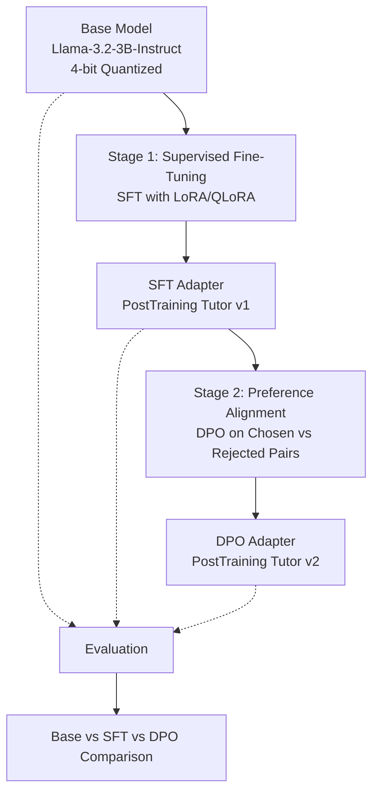

# LLM Post-Training Lab
### Building "PostTraining Tutor": a Domain-Specific AI Tutor via SFT, LoRA/QLoRA, and DPO

> A hands-on, end-to-end demonstration of the modern LLM post-training pipeline, taking a general-purpose base model and turning it into a small domain expert that explains LLM concepts (Transformers, LoRA, QLoRA, SFT, DPO, RLHF, Alignment) to learners.

---

## 1. Motivation

Most public tutorials stop at "here's how to fine-tune a model with LoRA." They rarely walk through the **full pipeline** a real post-training team uses i.e adapting a base model to a domain, teaching it to follow instructions, and then aligning its behavior with human preferences.

This repository was built to:

- Demonstrate the **complete post-training stack** — Base Instruction Model → SFT → DPO Alignment in one coherent project, rather than three disconnected tutorials.
- Produce a genuinely useful artifact: **PostTraining Tutor**, a lightweight model specialized in explaining LLM/post-training concepts (the same concepts used to build it which is a deliberately self-referential demo).
- Serve as a **teaching resource** for an AI talk/presentation, with every notebook cell explaining the *what*, *why*, and *how* behind each step, not just the code.
- Give a transparent, reproducible **base vs. SFT vs. DPO comparison**, so the effect of each stage is visible rather than assumed.

This is not a generic finance/customer-support chatbot demo, it is an educational tutor whose subject matter mirrors the technique used to train it.

---

## 2. Architecture / Pipeline Diagram



**Read it as:** a single base checkpoint flows through three additive training stages; at every stage we snapshot the model and run it through the same evaluation questions, so the final report shows *what each stage actually changed*.

---

## 3. Repository Structure

```
LLM-PostTraining-Lab/
│
├── data/                       # All datasets used across the three stages
│   ├── llm_post_training_corpus.txt      # Stage 1: raw domain text for continued pretraining
│   ├── instruction_dataset.jsonl         # Stage 2: instruction-response pairs for SFT
│   ├── preference_dataset.jsonl          # Stage 3: chosen/rejected pairs for DPO
│   └── evaluation_questions.json         # Fixed question set used for all evaluations
│
├── notebooks/                  
│   ├── 01_SFT_LoRA_Unsloth.ipynb         # SFT fine-tuning using LoRA/QLoRA via Unsloth
│   ├── 02_DPO_Alignment.ipynb            # Preference alignment on top of the SFT adapter
│   └── 03_Evaluation.ipynb              # Base vs SFT vs DPO comparison
│
├── src/                         # Reusable Python modules (so logic isn't only trapped in notebooks)
│   ├── dataset_utils.py                  # Loading/formatting datasets for each stage
│   ├── train_sft.py                      # Script version of the SFT training loop
│   ├── train_dpo.py                      # Script version of the DPO training loop
│   └── evaluate.py                       # Script version of the evaluation/comparison logic
│
├── reports/                     # Written explanations — the "why," for readers and reviewers
│   ├── fine_tuning_explanation.md
│   ├── lora_explanation.md
│   ├── dpo_explanation.md
│   └── results_analysis.md
│
├── presentation/                # Talk-ready material
│   ├── architecture_diagram.md           # Standalone Mermaid diagram + narration notes
│   └── slide_outline.md                  # 15-slide for presentation
│
├── outputs/                     # LoRA adapters, logs, evaluation tables (git-ignored — see .gitignore)
│
├── README.md
├── requirements.txt
└── .gitignore
```

**Why this shape?** Notebooks are what you *run* in Colab; `src/` holds the same logic as importable, testable functions so the project isn't "notebook-only"; `reports/` is where the conceptual explanations live so the notebooks themselves can stay code-focused; `presentation/` turns the whole repo into a ready-made talk.

---

## 4. Technology Stack

| Tool | Role in this project |
|---|---|
| **Google Colab** | Free GPU environment (T4/A100) to run all three training stages |
| **Unsloth** | 2–5x faster LoRA/QLoRA fine-tuning with lower VRAM use; used for Stage 1 & 2 |
| **Hugging Face Transformers** | Base model + tokenizer loading, generation/inference |
| **Hugging Face Datasets** | Loading and formatting `.jsonl` / `.txt` data into training-ready datasets |
| **PEFT** | Parameter-Efficient Fine-Tuning — implements LoRA adapter injection |
| **LoRA** | Low-Rank Adaptation — trains small adapter matrices instead of full weights |
| **QLoRA** | LoRA on top of a 4-bit quantized base model — cuts memory further |
| **TRL** | Hugging Face's Transformer Reinforcement Learning library — provides `SFTTrainer` and `DPOTrainer` |
| **PyTorch** | Underlying deep learning framework for everything above |

---

## 5. Dataset Explanation

| File                      | Stage      | Format                     | Purpose                                         |
| ------------------------- | ---------- | -------------------------- | ----------------------------------------------- |
| instruction_dataset.jsonl | SFT        | instruction-response pairs | Teaches instruction following                   |
| preference_dataset.jsonl  | DPO        | prompt/chosen/rejected     | Aligns responses toward preferred explanations  |
| evaluation_questions.json | Evaluation | question list              | Same questions used for Base/SFT/DPO comparison |


---

## 6. Training Stages Explained

### Stage 1 — Supervised Fine-Tuning (SFT) with LoRA / QLoRA
Using `instruction_dataset.jsonl`, the domain-adapted model is taught the instruction → response *format* using `TRL`'s `SFTTrainer`. Instead of updating all model weights, **LoRA** injects small trainable low-rank matrices into attention layers, and **QLoRA** additionally loads the frozen base model in 4-bit precision — so this stage is trainable on a free Colab GPU. Output: the first usable version of **PostTraining Tutor**.

### Stage 2 — Preference Alignment with DPO
Direct Preference Optimization takes the SFT model and, using `preference_dataset.jsonl` (chosen vs. rejected response pairs), directly optimizes the model to prefer the better response — without training a separate reward model or running full RLHF-style PPO. This is the same conceptual family as RLHF, but simpler to run end-to-end in a notebook.

### Evaluation — Base vs. SFT vs. DPO
`evaluation_questions.json` is run through all three checkpoints. Outputs are placed side-by-side in a table so the *incremental effect* of each stage is visible (e.g., does the SFT model answer in a cleaner format? Does the DPO model give more precise, less rambling explanations?).

---

## 7. How to Run the Notebooks

1. Open Google Colab → `Runtime > Change runtime type` → select a **GPU** (T4 is enough for a small base model with QLoRA).
2. Upload the contents of `data/` to the Colab session (or mount Google Drive and point paths there).
3. Run notebooks **in order**:
   - `01_SFT_LoRA_Unsloth.ipynb` → produces an SFT LoRA adapter, saved to `outputs/sft_adapter/`
   - `02_DPO_Alignment.ipynb` → loads the SFT adapter, produces a DPO adapter, saved to `outputs/dpo_adapter/`
   - `03_Evaluation.ipynb` → loads all three checkpoints and generates `outputs/evaluation_results.csv` + a comparison table
4. (Optional) Push the trained adapter to the Hugging Face Hub using the upload cell provided in Notebook 1.

---

## 8. Results 

## Results

The final evaluation was performed on 49 fixed questions covering LLM concepts, fine-tuning, LoRA, QLoRA, SFT, DPO, and alignment.

| Metric | Result |
|---|---|
| Evaluation questions | 49 |
| Base vs SFT identical outputs | 0/49 |
| Base vs DPO identical outputs | 0/49 |
| SFT vs DPO identical outputs | 23/49 |
| Average Base response length | 159.2 words |
| Average SFT response length | 158.8 words |
| Average DPO response length | 159 words |

Observations:
- SFT significantly changes response style compared to the base model.
- DPO further modifies response preferences and improves alignment with preferred explanations.
- DPO and SFT outputs remain similar on some questions, showing preference optimization refines rather than completely rewrites the model behavior.
**Qualitative observations:** _(e.g., "Base model rambles / gives generic ML history; SFT model answers directly in 2–3 sentences; DPO model is more concise and avoids hedging.")_


---

## 9. Future Improvements

- Add a small **reward-model-based RLHF (PPO)** stage as a third comparison point against DPO.
- Expand `evaluation_questions.json` and add an automated **LLM-as-judge** scoring script.
- Try a second base model size to study how post-training gains scale with model size.
- Merge the LoRA adapters into a single checkpoint and quantize for a lightweight deployable demo (e.g., via `llama.cpp` / GGUF).
- Add a minimal Gradio/Streamlit chat interface for live demo.

---

## License / Attribution

Educational project. Base models, datasets, and libraries retain their own respective licenses — check each before redistribution.
