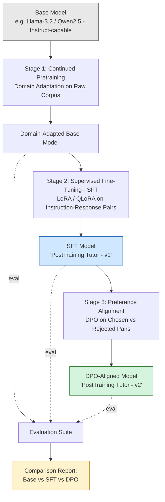

# LLM Post-Training Lab
### Building "PostTraining Tutor" — a Domain-Specific AI Tutor via Continued Pretraining, SFT, LoRA/QLoRA, and DPO

> A hands-on, end-to-end demonstration of the modern LLM post-training pipeline, taking a general-purpose base model and turning it into a small domain expert that explains LLM concepts (Transformers, LoRA, QLoRA, SFT, DPO, RLHF, Alignment) to learners.

---

## 1. Motivation

Most public tutorials stop at "here's how to fine-tune a model with LoRA." They rarely walk through the **full pipeline** a real post-training team uses: adapting a base model to a domain, teaching it to follow instructions, and then aligning its behavior with human preferences.

This repository was built to:

- Demonstrate the **complete post-training stack** — Continued Pretraining → SFT → Preference Alignment (DPO) — in one coherent project, rather than three disconnected tutorials.
- Produce a genuinely useful artifact: **PostTraining Tutor**, a lightweight model specialized in explaining LLM/post-training concepts (the same concepts used to build it — a deliberately self-referential demo).
- Serve as a **teaching resource** for an AI talk/presentation, with every notebook cell explaining the *what*, *why*, and *how* behind each step, not just the code.
- Give a transparent, reproducible **base vs. SFT vs. DPO comparison**, so the effect of each stage is visible rather than assumed.

This is not a generic finance/customer-support chatbot demo — it is an educational tutor whose subject matter mirrors the technique used to train it.

---

## 2. Architecture / Pipeline Diagram



**Read it as:** a single base checkpoint flows through three additive training stages; at every stage we snapshot the model and run it through the same evaluation questions, so the final report shows *what each stage actually changed*.

---

## 3. Repository Structure

```
LLM-PostTraining-Lab/
│
├── data/                       # All datasets used across the three stages
│   ├── llm_post_training_corpus.txt      # Stage 1: raw domain text for continued pretraining
│   ├── instruction_dataset.jsonl         # Stage 2: instruction-response pairs for SFT
│   ├── preference_dataset.jsonl          # Stage 3: chosen/rejected pairs for DPO
│   └── evaluation_questions.json         # Fixed question set used for all evaluations
│
├── notebooks/                  # Copy-paste-ready Google Colab notebooks (the core deliverable)
│   ├── 01_SFT_LoRA_Unsloth.ipynb         # Continued pretraining + SFT with LoRA/QLoRA via Unsloth
│   ├── 02_DPO_Alignment.ipynb            # Preference alignment on top of the SFT adapter
│   └── 03_Evaluation.ipynb               # Base vs SFT vs DPO comparison
│
├── src/                         # Reusable Python modules (so logic isn't only trapped in notebooks)
│   ├── dataset_utils.py                  # Loading/formatting datasets for each stage
│   ├── train_sft.py                      # Script version of the SFT training loop
│   ├── train_dpo.py                      # Script version of the DPO training loop
│   └── evaluate.py                       # Script version of the evaluation/comparison logic
│
├── reports/                     # Written explanations — the "why," for readers and reviewers
│   ├── fine_tuning_explanation.md
│   ├── lora_explanation.md
│   ├── dpo_explanation.md
│   └── results_analysis.md
│
├── presentation/                # Talk-ready material
│   ├── architecture_diagram.md           # Standalone Mermaid diagram + narration notes
│   └── slide_outline.md                  # 15-slide outline for the AI talk
│
├── outputs/                     # LoRA adapters, logs, evaluation tables (git-ignored — see .gitignore)
│
├── README.md
├── requirements.txt
└── .gitignore
```

**Why this shape?** Notebooks are what you *run* in Colab; `src/` holds the same logic as importable, testable functions so the project isn't "notebook-only"; `reports/` is where the conceptual explanations live so the notebooks themselves can stay code-focused; `presentation/` turns the whole repo into a ready-made talk.

---

## 4. Technology Stack

| Tool | Role in this project |
|---|---|
| **Google Colab** | Free GPU environment (T4/A100) to run all three training stages |
| **Unsloth** | 2–5x faster LoRA/QLoRA fine-tuning with lower VRAM use; used for Stage 1 & 2 |
| **Hugging Face Transformers** | Base model + tokenizer loading, generation/inference |
| **Hugging Face Datasets** | Loading and formatting `.jsonl` / `.txt` data into training-ready datasets |
| **PEFT** | Parameter-Efficient Fine-Tuning — implements LoRA adapter injection |
| **LoRA** | Low-Rank Adaptation — trains small adapter matrices instead of full weights |
| **QLoRA** | LoRA on top of a 4-bit quantized base model — cuts memory further |
| **TRL** | Hugging Face's Transformer Reinforcement Learning library — provides `SFTTrainer` and `DPOTrainer` |
| **PyTorch** | Underlying deep learning framework for everything above |

---

## 5. Dataset Explanation

| File | Stage | Format | Purpose |
|---|---|---|---|
| `llm_post_training_corpus.txt` | 1 — Continued Pretraining | Raw text | Exposes the model to domain vocabulary and phrasing (Transformers, LoRA, DPO, RLHF, etc.) via next-token prediction, *before* any instruction tuning |
| `instruction_dataset.jsonl` | 2 — SFT | `{"instruction": ..., "response": ...}` per line | Teaches the model to follow a question/instruction with a helpful, well-formed answer |
| `preference_dataset.jsonl` | 3 — DPO | `{"prompt": ..., "chosen": ..., "rejected": ...}` per line | Teaches the model to *prefer* better explanations over worse ones for the same prompt, without needing a separate reward model |
| `evaluation_questions.json` | Evaluation | List of question strings/objects | A fixed, held-out question set run through every model checkpoint (base, SFT, DPO) for a fair side-by-side comparison |

---

## 6. Training Stages Explained

### Stage 1 — Continued Pretraining (Domain Adaptation)
The base model already knows general English and general ML concepts from its original pretraining. Here it is further trained (causal language modeling, no instruction format) on `llm_post_training_corpus.txt` so it becomes fluent in the specific vocabulary and framing used in LLM post-training discussions. This is *not* an instruction-following stage — it just shifts the model's internal representations toward the domain.

### Stage 2 — Supervised Fine-Tuning (SFT) with LoRA / QLoRA
Using `instruction_dataset.jsonl`, the domain-adapted model is taught the instruction → response *format* using `TRL`'s `SFTTrainer`. Instead of updating all model weights, **LoRA** injects small trainable low-rank matrices into attention layers, and **QLoRA** additionally loads the frozen base model in 4-bit precision — so this stage is trainable on a free Colab GPU. Output: the first usable version of **PostTraining Tutor**.

### Stage 3 — Preference Alignment with DPO
Direct Preference Optimization takes the SFT model and, using `preference_dataset.jsonl` (chosen vs. rejected response pairs), directly optimizes the model to prefer the better response — without training a separate reward model or running full RLHF-style PPO. This is the same conceptual family as RLHF, but simpler to run end-to-end in a notebook.

### Evaluation — Base vs. SFT vs. DPO
`evaluation_questions.json` is run through all three checkpoints. Outputs are placed side-by-side in a table so the *incremental effect* of each stage is visible (e.g., does the SFT model answer in a cleaner format? Does the DPO model give more precise, less rambling explanations?).

---

## 7. How to Run the Notebooks

1. Open Google Colab → `Runtime > Change runtime type` → select a **GPU** (T4 is enough for a small base model with QLoRA).
2. Upload the contents of `data/` to the Colab session (or mount Google Drive and point paths there).
3. Run notebooks **in order**:
   - `01_SFT_LoRA_Unsloth.ipynb` → produces an SFT LoRA adapter, saved to `outputs/sft_adapter/`
   - `02_DPO_Alignment.ipynb` → loads the SFT adapter, produces a DPO adapter, saved to `outputs/dpo_adapter/`
   - `03_Evaluation.ipynb` → loads all three checkpoints and generates `outputs/evaluation_results.csv` + a comparison table
4. (Optional) Push the trained adapter to the Hugging Face Hub using the upload cell provided in Notebook 1.

---

## 8. Results 
| Metric               | Result  |
| -------------------- | ------- |
| Evaluation Questions | 49      |
| BASE == SFT          | 0 / 49  |
| BASE == DPO          | 0 / 49  |
| SFT == DPO           | 23 / 49 |

Average response length:

| Model | Average Words |
| ----- | ------------- |
| Base  | 159.20        |
| SFT   | 158.82        |
| DPO   | 159.00        |

## Observations
The SFT model produces responses with a different instruction-following style compared to the base model.
DPO further adjusts response preferences based on chosen/rejected examples.
DPO does not completely rewrite SFT behaviour; it refines selected aspects of response generation.
Both fine-tuned models show clear behavioural changes compared to the original base model.

---

## 9. Trained Adapters
SFT Adapter

Hugging Face:

https://huggingface.co/Hiteshwari7/posttraining-tutor-sft-adapter
DPO Adapter

Hugging Face:

https://huggingface.co/Hiteshwari7/postraining-tutor-dpo-adapter

## 10. Future Improvements

- Add a small **reward-model-based RLHF (PPO)** stage as a fourth comparison point against DPO.
- Expand `evaluation_questions.json` and add an automated **LLM-as-judge** scoring script.
- Try a second base model size to study how post-training gains scale with model size.
- Merge the LoRA adapters into a single checkpoint and quantize for a lightweight deployable demo (e.g., via `llama.cpp` / GGUF).
- Add a minimal Gradio/Streamlit chat interface for live demo during the talk.

---

## License / Attribution

Educational project. Base models, datasets, and libraries retain their own respective licenses — check each before redistribution.
