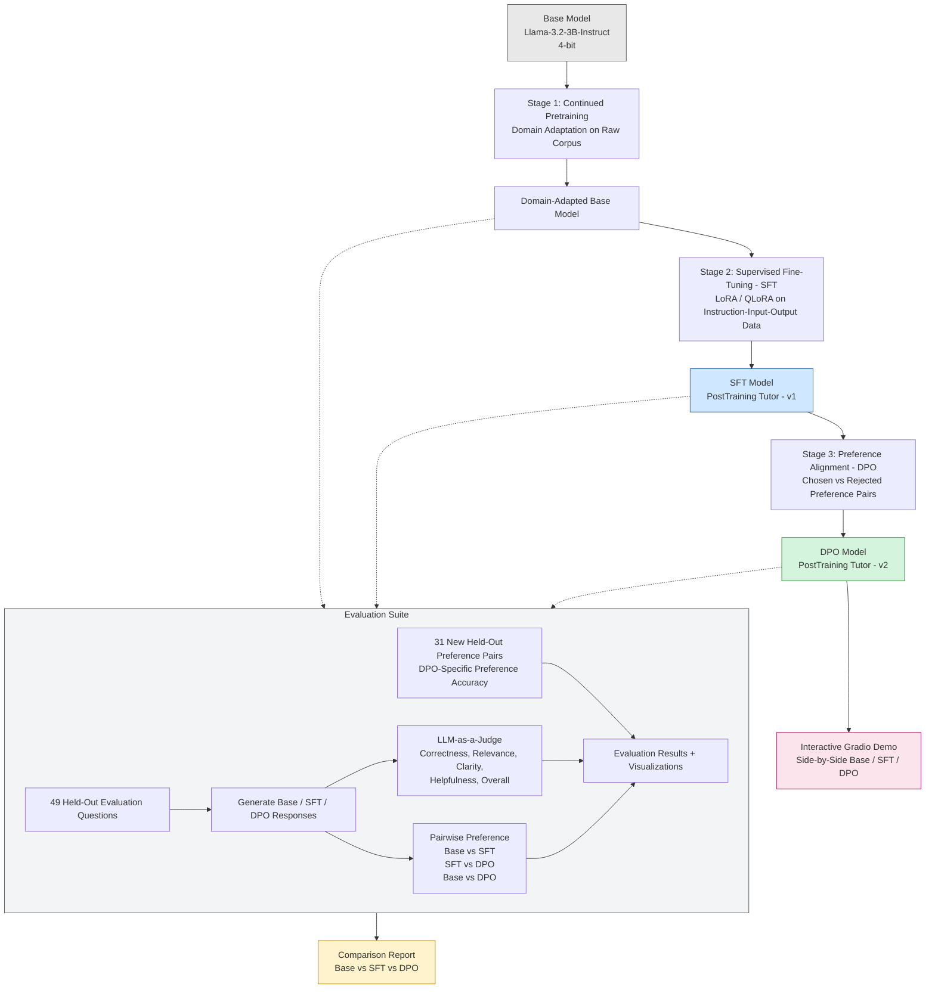

# Architecture Diagram 

```mermaid
flowchart TD
    A[Base Model<br/>Llama-3.2-3B-Instruct<br/>4-bit] --> B[Stage 1: Continued Pretraining<br/>Domain Adaptation on Raw Corpus]

    B --> C[Domain-Adapted Base Model]

    C --> D[Stage 2: Supervised Fine-Tuning - SFT<br/>LoRA / QLoRA on Instruction-Input-Output Data]

    D --> E[SFT Model<br/>PostTraining Tutor - v1]

    E --> F[Stage 3: Preference Alignment - DPO<br/>Chosen vs Rejected Preference Pairs]

    F --> G[DPO Model<br/>PostTraining Tutor - v2]

    C -.-> H
    E -.-> H
    G -.-> H

    subgraph H[Evaluation Suite]
        H1[49 Held-Out Evaluation Questions]
        H2[Generate Base / SFT / DPO Responses]
        H3[LLM-as-a-Judge<br/>Correctness, Relevance, Clarity,<br/>Helpfulness, Overall]
        H4[Pairwise Preference<br/>Base vs SFT<br/>SFT vs DPO<br/>Base vs DPO]
        H5[31 New Held-Out Preference Pairs<br/>DPO-Specific Preference Accuracy]
        H6[Evaluation Results + Visualizations]

        H1 --> H2
        H2 --> H3
        H2 --> H4
        H5 --> H6
        H3 --> H6
        H4 --> H6
    end

    H --> I[Comparison Report<br/>Base vs SFT vs DPO]

    G --> J[Interactive Gradio Demo<br/>Side-by-Side Base / SFT / DPO]

    style A fill:#e8e8e8,stroke:#555
    style E fill:#cfe8ff,stroke:#1a5fb4
    style G fill:#d4f4dd,stroke:#2e7d32
    style H fill:#f3f4f6,stroke:#555
    style I fill:#fff3cd,stroke:#b58105
    style J fill:#fce4ec,stroke:#ad1457
```

