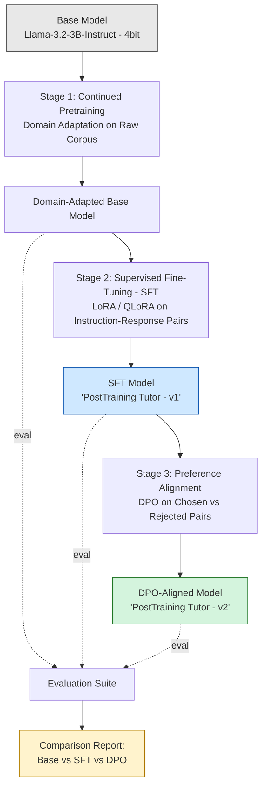

# Architecture Diagram

Standalone copy of the pipeline diagram from the README, with narration notes for presenting it live.

## Narration notes, box by box

- **Base Model (gray):** "We start with an already instruct-tuned model — Llama-3.2-3B — so we're refining behavior, not teaching from zero."
- **Stage 1 — Continued Pretraining:** "First, we don't touch instructions at all — we just keep pretraining on domain text, so the model gets fluent in *our* vocabulary: LoRA, DPO, RLHF, alignment."
- **Stage 2 — SFT (blue):** "Now we teach it the instruction→response *format*, using LoRA and QLoRA so this fits on a free Colab GPU. This produces v1 of PostTraining Tutor."
- **Stage 3 — DPO (green):** "Finally, we show it pairs of better/worse answers to the same question, and Direct Preference Optimization nudges it toward the better one — without needing a separate reward model or RL loop like classic RLHF."
- **Evaluation (yellow):** "Every stage gets snapshotted and run through the same fixed question set — so what you'll see next isn't a claim, it's a side-by-side comparison."

## Suggested live-demo order

1. Show the diagram (this file).
2. Show one before/after example straight from `reports/results_analysis.md`.
3. Optionally: run 2-3 live inference calls in `03_Evaluation.ipynb` if time allows.
