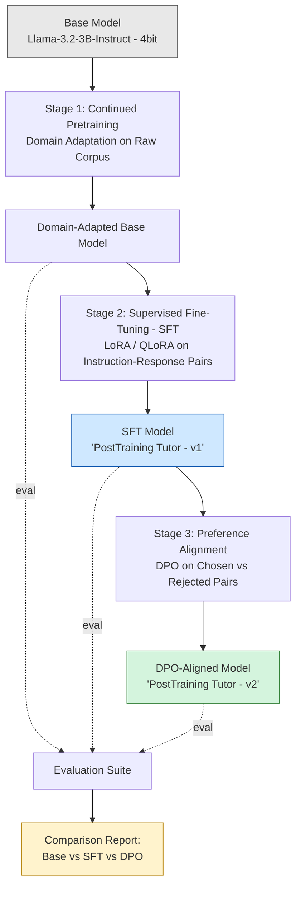

# Architecture Diagram 

```mermaid
flowchart TD
    A[Base Model<br/>Llama-3.2-3B-Instruct - 4bit] --> B[Stage 1: Continued Pretraining<br/>Domain Adaptation on Raw Corpus]
    B --> C[Domain-Adapted Base Model]
    C --> D[Stage 2: Supervised Fine-Tuning - SFT<br/>LoRA / QLoRA on Instruction-Response Pairs]
    D --> E[SFT Model<br/>'PostTraining Tutor - v1']
    E --> F[Stage 3: Preference Alignment<br/>DPO on Chosen vs Rejected Pairs]
    F --> G[DPO-Aligned Model<br/>'PostTraining Tutor - v2']

    C -.eval.-> H[Evaluation Suite]
    E -.eval.-> H
    G -.eval.-> H
    H --> I[Comparison Report:<br/>Base vs SFT vs DPO]

    style A fill:#e8e8e8,stroke:#555
    style E fill:#cfe8ff,stroke:#1a5fb4
    style G fill:#d4f4dd,stroke:#2e7d32
    style I fill:#fff3cd,stroke:#b58105
```

