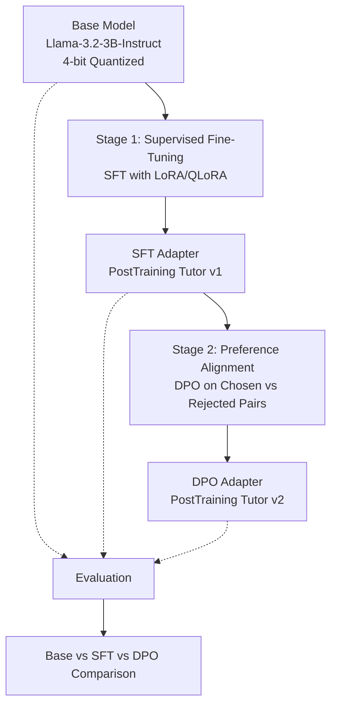

# Architecture Diagram

```mermaid
flowchart TD

A[Base Model<br/>Llama-3.2-3B-Instruct<br/>4-bit Quantized] --> B[Stage 1: Supervised Fine-Tuning<br/>SFT with LoRA/QLoRA]

B --> C[SFT Adapter<br/>PostTraining Tutor v1]

C --> D[Stage 2: Preference Alignment<br/>DPO on Chosen vs Rejected Pairs]

D --> E[DPO Adapter<br/>PostTraining Tutor v2]

A -.-> F[Evaluation]
C -.-> F
E -.-> F

F --> G[Base vs SFT vs DPO Comparison]
```
